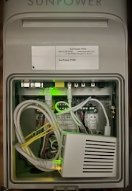

# SunPower PSV6 Supervisor Supervisor

Make a Raspberry Pi + python script to exfiltrate Photovoltaic solar data from unsupported hardware, without paying fees.

## Background Inspiration

For reference, this project was made for a SunPower PV system installed in 2019. Residential house in the northeast USA with a roof mounted system. 2 circuits, each with 6 Sunpower (actually Maxeon) PV panels & attached Enphase microinverters. No battery.

Sadly, I had a microinverter go bad but did not learn about it until **years later** when another 5 died. I only noticed that half the system was down when our electric bill going up and went 'down the rabbit hole'. Monitoring should NOT be left up to the user! Solar has to be come more friendly or it will not catch on in America. This project is hopefully is a small contribution to that.

The SunPower company sold perhaps ~586,000 installations before going backrupt. Luckily the panels and microinverters are under warranty, but the PVS monitoring unit is not. The PVS continues to send data to a server. A company SunStrong is selling app subscription to access the data.

## Approach

The basic approach, demonstrated by other projects, is that the PVS6 has a small computer inside running a web server. If you plug a laptop or other deivce into the internal ethernet port, and go to a 'web page' made for technicians, it will output the current state of the system, but no history or alerting. A Raspberry Pi inserted in the PVS6 case periodically calls a python script to run the code in this github project to catch the status and save for the future.

We want to:

1. Get the data off the PVS6, for future reference
1. Make it available to review trends by non programmers, e.g. a spreadsheet
1. Send alerts if something goes wrong.

**_This is meant to operate in the background. Not a dashboard! We all have enough to do!_**

## Script Actions

There are two scripts, running on the Raspberry Pi on a regular basis. It also works on my Mac, but a Raspberry Pi is more convenient and dependable for routine script running.

### collect-solar-data.py (every 15 minutes)

1. Query the PVS6 web interface
1. Save the output as a file on Raspberry Pi
1. Extract key production metrics, saves to PVS6_output/PVS6_output_overview.csv on Raspberry Pi
   - Timestamp
   - Lifetime PV Production (kWh)
   - Current PV Production (kW)
   - Current Consumption (kW) Net Power (kW)
1. Extract key production metrics, saves to PVS6_output/PVS6_output_inverters.csv on Raspberry Pi
   - Timestamp
   - Serial Number
   - Working / Error
   - Current PV Production (kW)
   - Lifetime PV Production (kWh)

### daily-solar-summary.py (every morning)

1. Saves daily production, etc as a row to PVS6_output/daily_summary.csv
1. (optional) save same row to Google sheet via API
1. (optional) Check for inverter anomalies and email alerts
1. (optional) Monthly summary email

**_Future ideas_**

- Load a weather API to get temperature and how cloudy it is locally
- the working/error status from inverters is not fully understood

### 2025 update to PVS firmware

A recent update to the PVS firmware enables direct requests to the PVS, without a Raspberry Pi going to the ethernet port. This is cool, and a direction for future development. This project is intended to run from the Raspberry Pi, but also works on a laptop in local network.

## Script Set up

1. Basic set up instructions are in rough shape on log.md. (Apologies, I'm tired)
1. Git pull script / repo on your machine or raspberry pi.
1. Copy `config.example.py` to `config.py` and edit with your values
1. Inverter-Status-Quick-Check.py is meant as a quick manual check on the status of the inverters. Meant to be run in a terminal on a local machine or SSH to a raspberry pi
1. Set up `collect_solar_data.py` program on the regular with crontab
   1. `crontab -e` edits crontab schedule on raspberry pi
   1. Add `*/15 6-21 * * * /home/sunpoweradmin/SunPower-PVS6-Supervisor-Supervisor/venv/bin/python /home/sunpoweradmin/SunPower-PVS6-Supervisor-Supervisor/collect-solar-data.py >> /home/sunpoweradmin/SunPower-PVS6-Supervisor-Supervisor/collect-solar-data-crontab.log 2>&1` Run every 15 minutes from 6 AM to 9 PM, saves output to a log file
   1. `tail -f ~/SunPower-PVS6-Supervisor-Supervisor/collect-solar-data-crontab.log` to watch the log file
1. Setup `daily-solar-summary.py` to run daily
   1. `crontab -e` edits crontab schedule on raspberry pi
   1. `0 6 * * * /home/sunpoweradmin/SunPower-PVS6-Supervisor-Supervisor/venv/bin/python /home/sunpoweradmin/SunPower-PVS6-Supervisor-Supervisor/daily-solar-summary.py >> /home/sunpoweradmin/SunPower-PVS6-Supervisor-Supervisor/daily-solar-summary-crontab.log 2>&1` runs every day
   1. saves values to a local daily_summary.csv
1. saving Daily values to a google sheet via API
   1. check log.md for notes
1. Emailing yourself monthly reports
   1. Enable 2-Factor Authentication (if not already enabled):
      1. Go to https://myaccount.google.com/security
      1. Under "Signing in to Google", enable "2-Step Verification"
   1. Create App Password:
      1. Go to https://myaccount.google.com/apppasswords
      1. Select "Mail" and "Other (Custom name)"
      1. Name it "Solar Monitor" or similar
      1. Click "Generate"
      1. Copy the 16-character password (remove spaces)
      1. Save this as SMTP_PASSWORD in config.py
      1. Never share this password - it gives full access to your Gmail account
   1. If the script doesn't find an email in the config.py, it doesn't send emails

### Gotchas

- The inverter(s) send a message approximately every 15 seconds when the microinverter is up and running -- which means when there's sunlight. The microinverters may report an error when there's heavy shading or at night.
- The PVS6 remembers each microinverter for a while (?) if it is not connected, it will report 'error', not disconnected

## References

**_I am indebted to other projects that inspired and informed this project. I hope I can pay it back to help others._**

- [Gruby](https://blog.gruby.com/2020/04/28/monitoring-a-sunpower-solar-system/)
- [ginoledesma/sunpower-pvs-exporter](https://github.com/ginoledesma/sunpower-pvs-exporter/blob/master/sunpower_pvs_notes.md)
- [Starreveld](https://starreveld.com/PVS6%20Access%20and%20API.pdf)
- [SunPower Docs and Python Code](https://github.com/SunStrong-Management/pypvs/tree/main)
- [documentation on VarServer parameters ](https://github.com/SunStrong-Management/pypvs/blob/main/doc/LocalAPI.md)

also

- [https://github.com/krbaker/hass-sunpower](https://github.com/krbaker/hass-sunpower)
- [https://github.com/jrconlin/sunpower_hass/tree/main/direct](https://github.com/jrconlin/sunpower_hass/tree/main/direct)
- [PVS5-6_Reverse_Proxy_Guide](https://github.com/MrStrabo/PVS5-6_Reverse_Proxy_Guide)

## Your friend, the PVS6, PhotoVoltaic Supervisor, version 6

The Sunpower PVS6 PhotoVoltaic Supervisor 6 is monitoring unit, typically installed near the near electrical panel. It just measures, mostly does not control the microinverters. Your solar panels will generate power and offset your consumption regardless of whether the PVS6 is online.

[User Manual](https://usermanual.wiki/SunPower/539848-Z.Users-Manual-rev-6022522.pdf)

Note there are several ways for solar systems to work, mine has a microinverter on each solar panel, but other systems have one big inverter or even a battery. **Please keep in mind this software is only tested on a basic microinverter system.**

PVS6 were manufactured and sold in the US by SunPower, which unfotunately went out of business. SunStrong has resuscitated the server and has an app with a monthly subscription. It works well, but has limited information and no alerting. If you ask, they will enable panel level monitoring, which can show if one panel is not working.

### How does the PVS6 work?

1. The PVS6 'listens' to certain circuits the Solar Panels & Microinverters are on. The microinverters send a message on the AC electical wiring, called "Power Line Communication". PVS6 get production data from micro inverters. NO wireless communication from micro inverters to PVS6.
1. PVS6 also has white/black, white/red braided cables. These go to Current Transformers which measures electical current on your circuit breakers (estimates but accurate). The PVS6 has measurements for Consumption and Production

The PVS6 does NOT talk to your electrical grid. These are all estimates, but said to be faily accurrate.

### How to ask for the data, nicely

Tips on accessing the PVS6, from either a raspberry pi, or local mac
Building on tips on the [2025 way to access the PVS6](https://www.reddit.com/r/SunPower/comments/1lh7x90/the_agony_and_the_ecstasy_of_varserver_and_dl_cgi/) and [SunStrong code library example page](https://github.com/SunStrong-Management/pypvs/blob/main/doc/LocalAPI.md)

The PVS6 has a small web server that shares its internal info. But you can't just load the page in a web browser, because of security limitations.

You can call the PVS6 web server using a terminal command, CURL on your laptop on the same network

**First You set 2 variables**

<pre>
auth=echo -n "ssm_owner:A1234" | base64
ip=echo -n "192.168.0.14"
</pre>

A1234 = last 5 digits of your PVS serial number.  It is on the device, inside the cover.  The last 5 should looks something like A1234.
ip = the local wifi IP address of your PVS6

If accessing the PVS6 via the ethernet port, use <pre>ip=echo -n "//172.27.153.1"</pre>

**Then you log in**

<pre>
curl  \
-k \
-b cookies.txt \
-c cookies.txt \
-H "Authorization: basic $auth" \
"https://$ip/auth?login"
 </pre>

_cookies.txt is a file containing cookies (used to store auth tokens) The script makes it, you can basically ignore it_

**Then you ask for al the data**

<pre>
curl \
 -k \
-b cookies.txt \
-c cookies.txt \
"https://$ip/vars?match=/&fmt=obj"
 </pre>

**Or you can make a file out of it**

<pre>curl \
 -k \
-b cookies.txt \
-c cookies.txt \
"https://$ip/vars?match=/&fmt=obj" \
-o "$HOME/Desktop/PVS6output_$(date +%Y%m%d_%H%M%S).json"
 </pre>

_The chrome browser can open this JSON file and it is slightly easier to read_

**There are parameters to get just some data**

“Match” to get just the meter data

I am working on a small script to keep an eye on my PVS6, let me know interested in hearing more

<pre>curl
 -k 
-b cookies.txt 
-c cookies.txt 
"https://$ip/vars?match=meter/" -o "$HOME/Desktop/PVS6output_$(date +%Y%m%d_%H%M%S).json"
</pre>

**Or ask for specific variables by name**

<pre>curl
 -k 
-b cookies.txt 
-c cookies.txt 
"https://$ip/vars?name=/sys/info/sw_rev,/sys/info/lmac"
</pre>

**You can ask that the output data be formatted more cleanly**

<pre>
curl -k
-b cookies.txt
-c cookies.txt
"https://$ip/vars?name=/sys/info/sw_rev,/sys/info/lmac&fmt=obj"
</pre>

**_Note there was until 2025 another command to access the info, called_**

<pre>curl
   http://172.27.153.1/cgi-bin/dl_cgi?Command=DeviceList -o "$HOME/PVS6outputJSON/$(date +%Y%m%d\_%H%M%S).json"</pre>>

This is not supported when accessing the PVS6 directly, but may still work on the ethernet port, or on older firmware.

### Understanding the data output

The PVS6, when queried, returns JSON formatted data
[VarServer example using &fmt=obj](example_data/PVS6_varserver_output_20250930_115822.json)
[older DL_CGI example](example_data/PVS6_DL_CGI_output_example.json)
